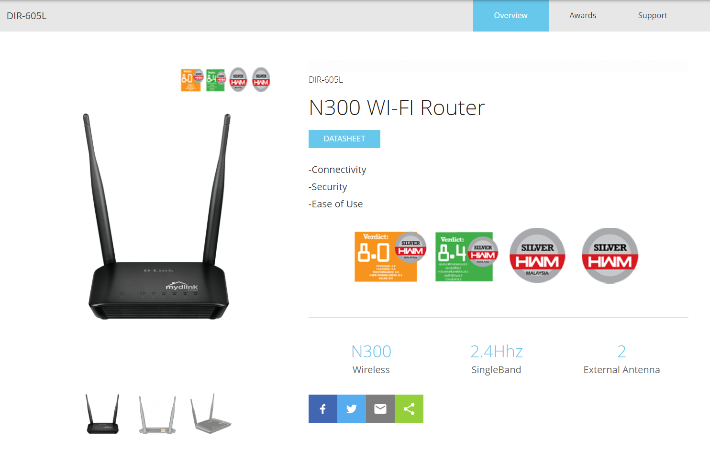
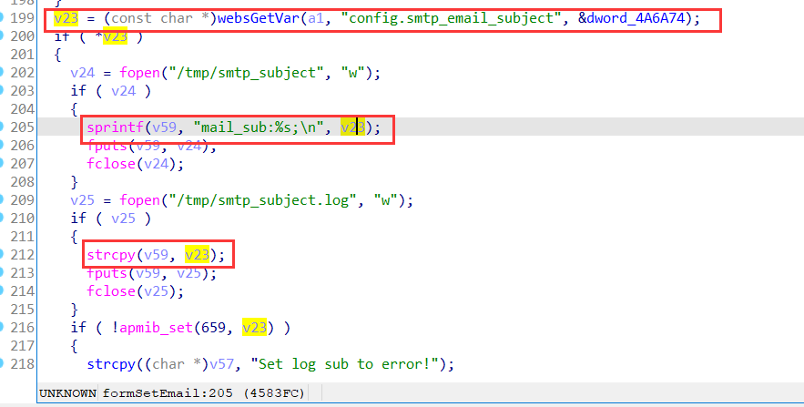

# Overview
Vendor of the products: D-Link (https://www.dlink.com/)

Reported by: xsz of HIT-IDS ChunkL Team

Product: D-Link DIR-605L

Affected firmware Version: 2.13B01 BETA

Firmware: https://support.dlink.com/resource/SECURITY_ADVISEMENTS/DIR-605L/REVB/DIR-605L_REVB_FIRMWARE_v2.13B01_BETA.zip



# Vulnerability Details
A stack-based buffer overflow vulnerability exsist in D-Link N300 WI-FI Router DIR-605L (firmware version v2.13 B01 Beta) which may result in remote code excution or deninal of service. The issue exists in the binary "boa" which resides in "/bin" folder, and the binary is responsible for serving http connection received by the device. 

While processing the post reuqest "/goform/formSetEmail", the value of "config.smtp_email_subject" parameter (as shown at line 199 of Figure A) which can be arbitrarily long is eventually copied onto stack memory by "sprintf" function (as shown at line 200-215 of Figure A), and could lead to a buffer overflow. The attackers can construct a payload to carry out arbitrary code attacks.



Figure A: The decompiled code of function which read value of parameter "config.smtp_email_subject" and call sprintf/strcpy function with the value as a parameter.

# Reproduce and POC
To reproduce the vulnerability, the following steps can be followed:
1. Start frimware through QEMU system or other methods (real device)
2. Use the default username and password to login web.
3. Execute the poc script as follows:

```shell
python3 POC_for_formSetEmail.py <target_ip>
```

# Reply by Official
Already reported to the vendor, no response yet...