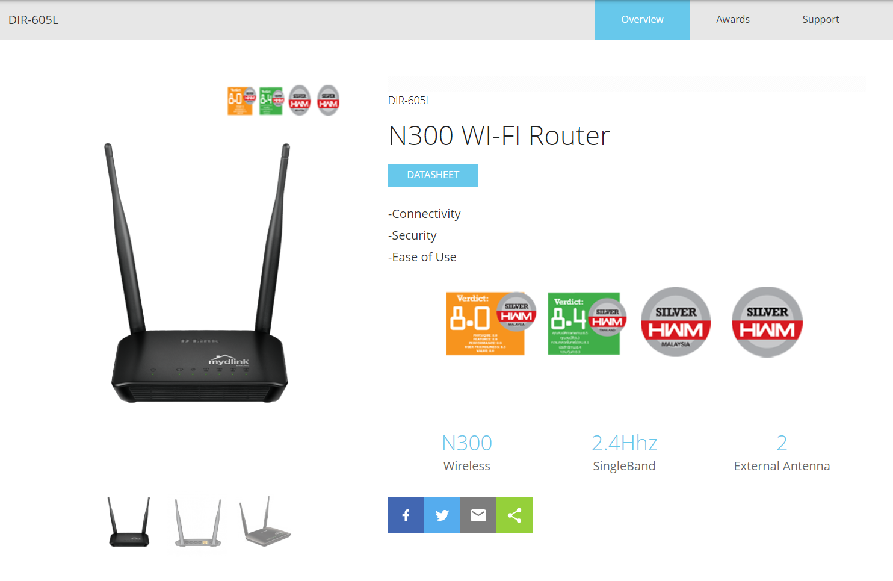

# Overview
Vendor of the products: D-Link (https://www.dlink.com/)

Reported by: xsz of HIT-IDS ChunkL Team

Product: D-Link DIR-605L

Affected firmware Version: 2.13B01 BETA

Firmware: https://support.dlink.com/resource/SECURITY_ADVISEMENTS/DIR-605L/REVB/DIR-605L_REVB_FIRMWARE_v2.13B01_BETA.zip



# Vulnerability Details
A stack-based buffer overflow vulnerability exsist in D-Link N300 WI-FI Router DIR-605L (firmware version v2.13 B01 Beta) which may result in remote code excution or deninal of service. The issue exists in the binary "boa" which resides in "/bin" folder, and the binary is responsible for serving http connection received by the device. While processing the post reuqest "/goform/formSetWanDhcpplus", the value of "curTime" parameter which can be arbitrarily long is copied onto stack memory by "sprintf" function (as shown at line 72, 254 of Figure A), and could lead to a buffer overflow. The attackers can construct a payload to carry out arbitrary code attacks.


Figure A: The decompiled code of function which read value of parameter "curTime" and call sprintf function with the value as a parameter.

# Reproduce and POC
To reproduce the vulnerability, the following steps can be followed:
1. Start frimware through QEMU system or other methods (real device)
2. Use the default username and password to login web.
3. Execute the poc script as follows:

```shell
python3 POC_for_formSetWanDhcpplus.py <target_ip>
```

# Reply by Official
Already reported to the vendor, no response yet...