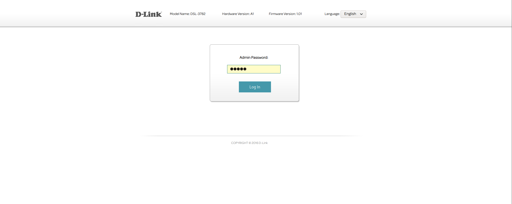
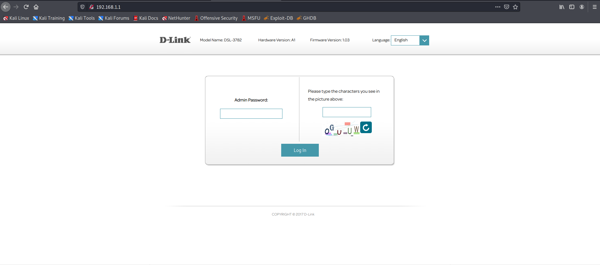
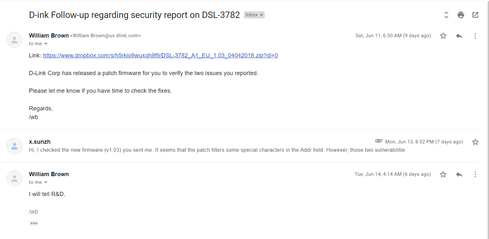

Some vulnerabilities (including a stack-based buffer overflow and a command injection) exist in the D-Link DSL-3782 Wi-Fi router 1.01 and 1.03. An authenticated remote attacker can execute arbitrary code via the Addr field in the request sent to the Diagnostics.asp page. Different from CVE-2018-8941, the vulnerable binary program is `cfg_manager`, which is used to perform tracroute or ping functions. And according to our testing, these vulnerabilities still exist on the latest firmware (v1.03) of this router.

1. [Command injection](https://github.com/1160300418/Vuls/blob/main/D-Link/DSL-3782/CMDi_in_D-Link%20DSL-3782.md) -CVE Number:[CVE-2022-34527](https://nvd.nist.gov/vuln/detail/CVE-2022-34527)
   - In the codes of the cfg_manager program, which are used to perform the *Diagnostics* function , the *sprintf* method directly uses the parameter from the web requests. The authenticated attackers can construct a payload to carry out arbitrary code attacks. To bypass the filter method, attackers can use the "%0a" as the delimiter.
2. [Stack-based buffer overflow](https://github.com/1160300418/Vuls/blob/main/D-Link/DSL-3782/BOF_in_D-Link%20DSL-3782.md) -CVE Number:[CVE-2022-34528](https://nvd.nist.gov/vuln/detail/CVE-2022-34528)
   - In the getAttrValue function of the cfg_manager program, the strcpy method directly uses the service parameter from the tcapi program. The attackers can construct a payload to carry out arbitrary code attacks via Diagnostics webpage.

We have reported the vulnerability to the vendor and got confirmation.

